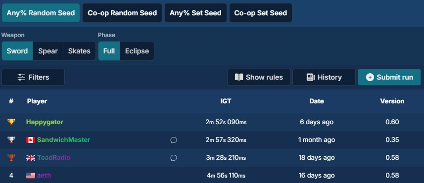
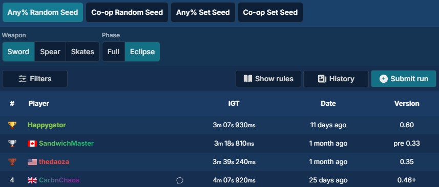
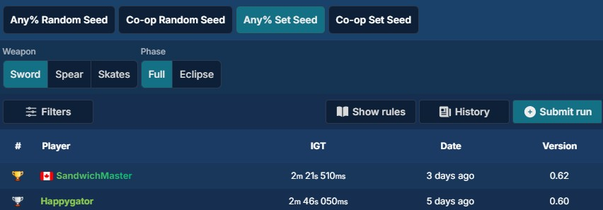
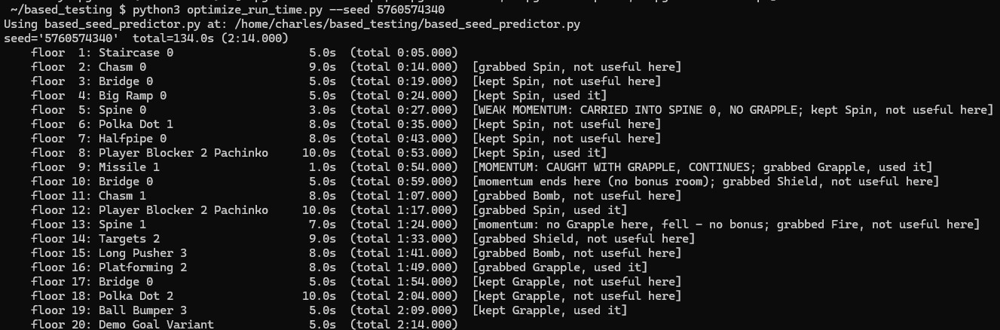
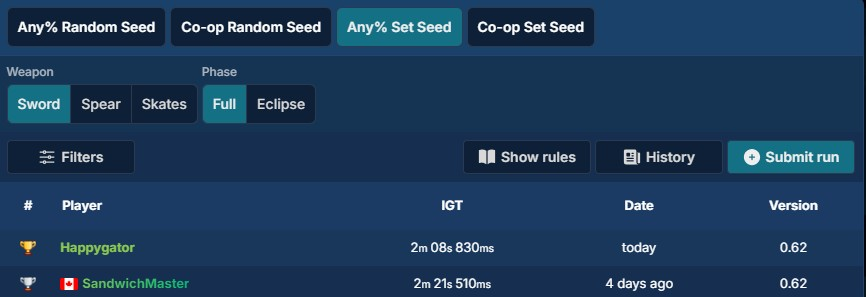

# Reverse-Engineering BASED's RNG because I wanted 1st on the speedrun leaderboard

## Based on what?

[BASED](https://store.steampowered.com/app/4015070/BASED/) is a quaint game about performing platform-fighter attacks to combo the
moon into the sky. 

A couple of weeks ago I played through the demo, liked how smooth the game felt,
and decided to try speedrunning it. As the demo of a small indie game, I figured
the speedrunning scene would be basically nonexistent — and a look at its
[speedrun.com page](https://www.speedrun.com/BASED) confirmed it: nearly every category had three
runs or fewer. Easy #1, I figured. So I recorded a handful of runs for Sword
Any%, submitted them, and all was well.






*I'm technically a world record holder now. Yippee!*

They've also got a category for **Set Seed**, and the game's Discord said their
next goal was any sub-2:50 time. I made a handful of mistakes in my Full Moon
Any% run, but the seed was pretty good and I still managed a 2:52 — so let me
just record another run without those mistakes and submit it!

I come back to the speedrun leaderboard to find my day ruined.




*Second place? How? That guy's time is **so** much faster than mine!*


*My live reaction to this information.*

I watch his run, and discover that the seed he used is way better than mine.
SandwichMaster rolls fast room after fast room in his run and gets to perform
tons of skips that I couldn't in my run, which uses just an "above average"
seed that I found by just playing a bunch of runs.

It would be easy to just play through the seed he used with slightly tighter
movement, but then my time would be vulnerable to getting sniped if he comes up
with another, faster seed. In order to defend the spot thoroughly, I would have
to find seeds myself until I could be truly sure that it was a high bar to clear.

## What is a seed?

Almost nothing in a video game is *truly* random.[^rng] When BASED needs to
"randomly" decide which rooms you'll play through, which powerup appears on each
floor, and where enemies spawn, it isn't rolling real dice — it's running a fixed
formula that produces a fixed sequence of numbers. The single input to that
formula is called the **seed**.

The handy way to picture it: a seed is like a page number in an enormous book of
pre-written "random" sequences. Feed the game the same seed and it turns to the
same page every time — the same rooms, the same powerups, in the same order.
Change the seed and you flip to a completely different page. That's why this kind
of system is called a *pseudo*-random number generator: it looks random, but
it's perfectly reproducible the moment you know the seed.

A BASED run is 20 floors (19 are random, and floor 20 is always the predetermined
goal room), and the seed fixes all of it in advance — the room on
each floor, the powerup orb that floor hands you, and (together with a difficulty
setting the player picks) which enemies show up. Type in seed `1` and you get
exactly the same 20-floor layout as everyone else who has ever typed `1`.

That total reproducibility is the whole basis of a **Set Seed** run — and, as the
leaderboard taught me, it's far more competitive than it sounds, because rooms
are not created equal. Some are short, some drag on; some powerups (a well-timed
movement ability) let you skip huge chunks of a floor, while others do nothing
for your particular route. Since the seed locks in the entire sequence before you
ever press start, a seed that happens to chain short rooms together with the
right powerups in the right order is worth *seconds* over an ordinary one. My
rival hadn't out-played me. He'd out-*seeded* me.

Which points straight at the obvious question. If a run is completely determined
by its seed before it even begins, could you work out what a seed will throw at
you *without* playing it — or, better yet, go hunting through every possible seed
for the single fastest run in the game?

---

## How do you reverse-engineer an RNG?

Answering that meant figuring out exactly how BASED turns a seed into a run —
every room, every powerup, every enemy — and then rebuilding that whole process
outside the game so I could run it thousands of times a second. Here's roughly
how that went.

**It's a Unity game, and that's the whole ballgame.** The first lucky break is
that BASED is built in Unity, which means the game's logic ships as compiled C# —
ordinary .NET assemblies (`.dll` files) sitting right there in the game folder.
C# doesn't compile down to inscrutable machine code the way a C++ game would; it
compiles to a bytecode that decompiles back into almost-readable C# source. So
instead of squinting at raw assembly, I could essentially read the developers'
own code. A tool called **AssetRipper** does the heavy lifting: point it at the
game and it spits the whole thing back out — the code assemblies *and* all the
art, prefabs, and designer settings that were configured in the Unity editor.

**Finding the actual dice-roller.** Digging through the decompiled `Core.dll`,
the random-number generator turned out to be simple enough: a little
class that holds a single integer — call it the counter — and, every time the
game wants a random number, bumps that counter by one and runs it through a small
hashing function. That's the entire thing. No elaborate internal state, no
seeding ceremony. The seed you type just gets hashed once to decide where the
counter starts. Right next to it were the classes that actually *use* those
numbers: the map generator that picks rooms, the bit that rolls powerups, and the
enemy spawner.

**Rewriting it in Python.** Once I could read the code, I re-implemented the whole
chain in Python so I could run it without launching the game. The hard part
wasn't the logic — it was that C# does arithmetic in ways Python doesn't, and I
needed my version to spit out the *exact same* numbers, down to the last bit, or
the predictions would drift off course. C# integers silently wrap around when
they overflow; its rounding breaks ties toward even numbers; the string-hashing
quietly mangles capital letters and strips spaces before it even starts. Miss any
one of those and everything downstream doesn't line up, so a good chunk of the
work was just chasing down and matching those quirks.

**Digging the data out.** The code is only half the story — it constantly reads
values the designers set in the editor: which rooms are allowed to appear, how
hard each floor should be, which enemies a given room can spawn. AssetRipper hands
those over too, buried in the exported project. Mostly this was tedious rather
than tricky, with one exception: the list of "elite" floors, which AssetRipper
rendered flat-out wrong, mashing the real numbers into a garbled value. I ended
up reading the raw bytes of that field by hand —

```
01 00 00 00   13 00 00 00
```

— to recover the real answer: exactly one elite floor, floor 19. (A nice sanity
check backed it up: floor 19 is the only floor hard enough for the game's elite
rooms to even be eligible for generation, and there was a patch note explicitly
saying that Floor 19 always contained a "hard" room.)

**Checking it against reality.** None of this is worth anything if it doesn't
match the real game, so I recorded an actual run on seed `1` and compared it
floor-by-floor against my predictor. It immediately caught two honest bugs — an
off-by-one in how floors are counted, and a case where I had the room list in the
wrong order — but once those were fixed, it nailed all 20 floors: every room,
every powerup, and every enemy, exactly. 

---

## So how does the RNG actually work?

With all of that pieced together, the whole system is short enough to describe in
three steps:

1. **Your seed becomes a single number.** The game takes the seed you typed,
   cleans it up (uppercases it, throws away spaces and invisible characters), and
   hashes it down to one 32-bit integer — the *counter*. From that point on, your
   original text is never looked at again. Two different seeds that happen to hash
   to the same number produce identical runs.

2. **The counter becomes a stream of "random" numbers.** Whenever the game needs a
   roll, it nudges the counter up by one and mixes it through a fixed hash to get
   the next value, then squeezes that into whatever range it needs — a difficulty
   level, a pick from a list, a yes/no chance. Since every value is just a hash of
   the counter, there's no real randomness hiding anywhere: the counter's current
   value tells you everything.

3. **Those numbers become your run.** The game keeps a few of these counters going
   in parallel and draws from them to choose each floor's room (from a filtered
   list that avoids recent repeats), its powerup, and its enemies (with an extra
   difficulty setting you pick in the lobby). Stack 20 floors of that up and you've
   got a full run.

And here's the punchline that kicked off this entire project: because a run is
nothing more than a function of one 32-bit number, there are only about **4.3
billion** possible runs in the whole game — and typing a seed is just a way of
landing on one of them, more or less at random. 4.3 billion sounds enormous, but
to a computer it's small enough to grind through *every single one* and pick out
the outright fastest run that exists. Which is exactly what I set out to do.

---

## How can I find a good seed to run?

With these tools, I could take any seed and print its entire run without ever opening the
game, but knowing *what* a run contains still isn't the same as knowing whether
it's fast. To actually hunt for the best one, I needed two more things: a way to
score a run, and a way to search without checking billions of seeds by hand.

**Putting a time on a run.** A seed's rooms and powerups are locked in the moment
you know it, but how *fast* that run can be played still takes some figuring out.
Every room takes some baseline time to clear, but the powerups bend that number
all over the place: the right movement ability on the right floor lets you skip a
huge chunk of it, carry momentum from one room into the next, or blow past an
obstacle that would otherwise cost you seconds — and some powerups only pay off if
you use them in one very specific spot. So on top of the predictor I wrote a small
optimizer: hand it a seed's 20 rooms and the powerups it doles out, and it works
out the *fastest possible* way to play that exact sequence, then hands back a
single number — this seed's best-case time. With that, any two seeds can be
compared head-to-head, and a "good" seed is simply one with a small number.

**Why you can't just check every seed.** The obvious plan is to loop over seeds —
`1`, `2`, `3`, and so on — score each one, and keep the best. The trouble is baked
into how seeds work: the string you type doesn't matter, only the 32-bit number it
hashes to. Marching through seed *strings* just flings you randomly across those
4.3 billion numbers — you keep landing on ones you've already seen (wasted work),
skip over enormous stretches you never check at all, and to be even halfway sure
you'd found the best run you'd have to grind through *tens of billions* of strings
and still couldn't prove it. And I didn't just want a good seed; I wanted to know
I'd set a bar nobody could easily beat. Random sampling can never give you that.

**Searching the runs directly, then working backward to a seed.** The way out
falls right out of the RNG's biggest weakness. Since a run depends only on that
one 32-bit number, I can ignore seed strings entirely and just march through the
numbers themselves — 0, 1, 2, all the way up to 4.3 billion. Each one is a
distinct possible run, with no duplicates and no gaps, so if I compute the
best-case time for every number and store it in one enormous table, I'm no longer
*sampling* anything: I've got the fastest time for every run the game can possibly
produce, and finding the best is just reading off the smallest entry. The catch is
that the game won't let you type one of those numbers — it only takes a seed
string, which it then hashes. So once the table points me at the winning number, I
have to run the whole thing backward and dig up a seed string that hashes to
exactly that value. The hash can't be reversed, so this is its own brute-force
search — try strings until one lands on the target — but because the hash sprays
strings roughly evenly across all 4.3 billion possibilities, any particular target
is reachable with decent odds inside a few billion tries (roughly a 63% chance by
the time you've tried 4.3 billion of them). Find that string, type it in, and I'm
finally standing on the single fastest seed in the game.

---

## Did it work?

As a first pass I scanned just the first **200 million** seeds — well under 5% of the 4.3 billion. I found many seeds that were promising, but focused on hash code **17771233**, which happened to stack several fast rooms and had room for some experimental high-speed tech.



That's a hash index, though, not something the game lets you type. So I ran the
reverse search and turned up a seed string that hashes straight to it:
**5760574340**. I played it start to finish once just to confirm the run was
actually real — that the rooms, powerups, and skips lined up exactly the way the
predictor claimed — and they did.

After that it was pure execution, and I ran the seed over and over until I was satisfied. The result was a **2:08**[^estimate], which you can
[watch here](https://www.youtube.com/watch?v=cM_5PenbhzE).

That's more than ten seconds under the previous record — and more than enough to
take my spot back.



*Victory.*

---

## What's next?

If I could manually rig every floor and powerup, this is what I'd run:

| Floor | Difficulty | Room | Powerup | Time |
|:-:|:-:|:--|:--|:-:|
| 1 | 0 | Big Ramp 0 | Spin | 5s |
| 2 | 0 | Spine 0 | Grapple | 1s |
| 3 | 1 | Bridge 0 | — | 5s |
| 4 | 0 | Staircase 0 | — | 5s |
| 5 | 0 | Button Vertical Gate 0 | Fire | 4s |
| 6 | 1 | Hittable Walls 1 | Fire † | 6s |
| 7 | 1 | Bridge 0 | — | 5s |
| 8 | 2 | Player Blocker 2 Pachinko | Spin | 10s |
| 9 | 1 | Missile 1 ‡ | Grapple | 1s |
| 10 | 1 | Ball Bumper 1 | — | 7s |
| 11 | 2 | Blocks 2 | Fire | 6s |
| 12 | 2 | Chasm 1 | — | 8s |
| 13 | 1 | Spine 1 | — | 7s |
| 14 | 2 | Player Blocker 2 Pachinko | Spin | 10s |
| 15 | 3 | Ball Bumper 3 ‡ | Grapple | 1s |
| 16 | 2 | Chasm 1 | — | 8s |
| 17 | 1 | Spine 1 | — | 7s |
| 18 | 2 | Player Blocker 2 Pachinko | Spin | 10s |
| 19 | 3 | Ball Bumper 3 ‡ | Grapple | 1s |
| 20 | — | Goal | — | 5s |
| **Total** | | | | **112s** |

- **†** Uses a second banked Fire, not this floor's own orb.
- **‡** Momentum carried in from the previous Player Blocker 2 Pachinko (Spin) —
  with Grapple, the room clears in a single second.

Each room is slightly over-estimated, so flawless movement would likely put the final time
at around 105s, or 1:45.

Obviously, such a miraculous seed likely doesn't exist, but grinding through the full space 
will find the real, typeable seed that gets as close to it as the RNG will allow. I expect that a seed exists that can reach sub-2:00, but each timesave is exponentially sparser
than the last.[^sparse]

Hilariously, rigging set seeds can theoretically work for the random seed category.
The seed the game "randomly" uses is equivalent to the number of milliseconds that your computer has been on, meaning that pressing the "Create Lobby" button in the main menu at
the right time could roll any (feasibly reachable) seed and guarantee an impossibly fast time.
If you fail, though, you have to reboot your computer to try again, resulting in possibly
the single worst speedrun strategy I've ever seen.

[^rng]: Strictly speaking, computers can't cook up true randomness on their own — they're deterministic machines that do exactly what they're told. To fake it convincingly, they seed their "randomness" from things that are miserable to predict: the exact sub-millisecond timing of your keystrokes and mouse jitters, noisy hardware and environment readings, or — famously — the wall of lava lamps that Cloudflare films and feeds into the randomness behind a big slice of the internet's encryption. BASED skips all of that and just starts from a number to enable setting seeds for runs.

[^estimate]: The real run beat the estimated "best case time" of 2:14 for two reasons: I found a few extra timesaves while grinding attempts, and every room's time estimate is deliberately rounded up, so the predicted total always leans a little pessimistic.

[^sparse]: A run only gets faster when more of its floors happen to roll their ideal room-and-powerup at once, and each floor lining up perfectly is a roughly independent long shot. Demanding one *more* perfect floor multiplies the rarity: if a single good floor turns up in, say, 1 of every 10 seeds, two good floors is roughly 1 in 100, three is 1 in 1,000, and so on. Since each set of 1-4 seconds shaved off needs roughly one more floor or powerup to fall into place, the seeds that deliver it get exponentially rarer, to the point that a seed that has truly everything perfect almost certainly doesn't exist in the "only" 4 billion possible hash values.